<h1 align="center">Hey 👋 I'm Agustín Romero</h1>
<h3 align="center">A Full Stack Developer from Argentina</h3>

## About Me

<p>I am a person passionate about programming, specifically about Web Development. In my journey I have carried out several individual and group projects in which I developed my technical and soft skills. I love working and solving problems in a team, I believe that a different look at the problem is always helpful.</p>
<p>Regarding my goals as a programmer, I think to delve deeper in my current knowledge and others, through future projects to know more about their operation and best practices. I am also interested in other areas of programming and its variants, so I am more than willing to learn other languages like PHP, Java, Python, etc...</p>

<br>

## 💻 Tech Stack Frontend:


## 💻 Tech Stack Backend:


## 🧰 WorkShop


<br>

### **My GitHub Stats:**

<p style="margin-top: 10px">&nbsp;</p>

<br>

[](#)

<br>

## This is my work 🗂

---

## **PokeAP [poke-api]**

```
📌 Henry Bootcamp Individual Project
I worked as a full stack developer integrating a web application with the name 'PokeAPI'.
With its three essential elements: frontend, backend and database.
There you will be able to see pokemons from the animated series 'Pokemon',
see details of each one, and create your own pokemons.

Tech Utils:
Frontend - HTML, CSS, Javascript, ReactJS, Redux
Backend - NodeJS, Express, Sequelize
Database: PostgreSQL
```

<p align="center">
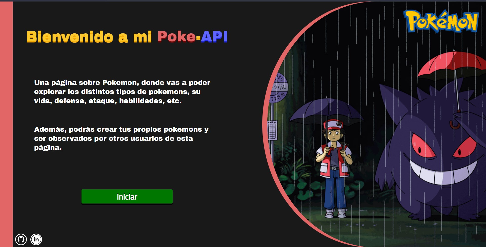
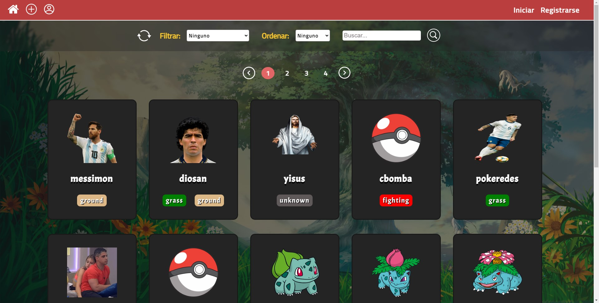
</p>
<p align="center">
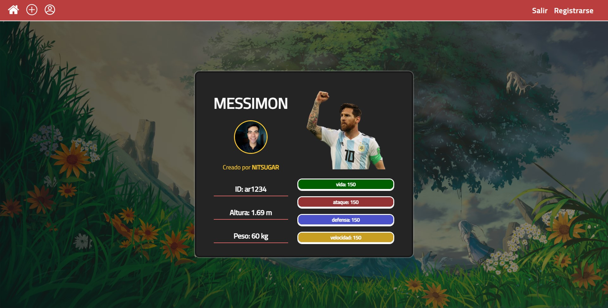
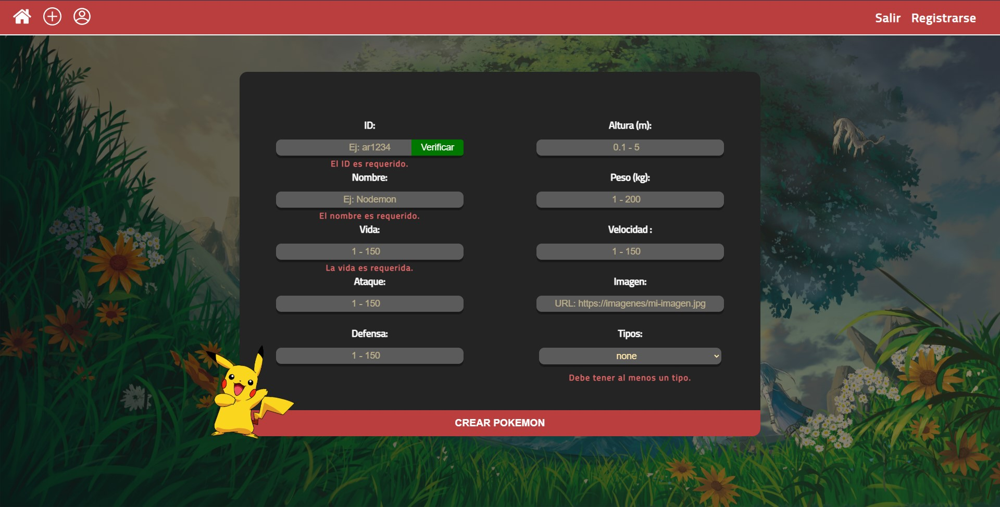
</p>
<p align="center">
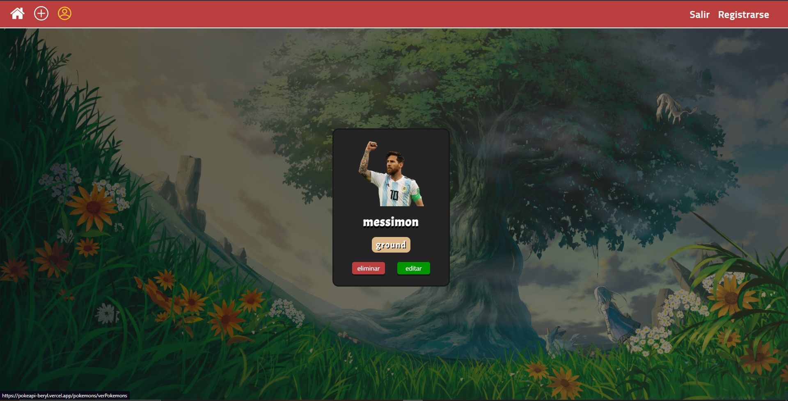
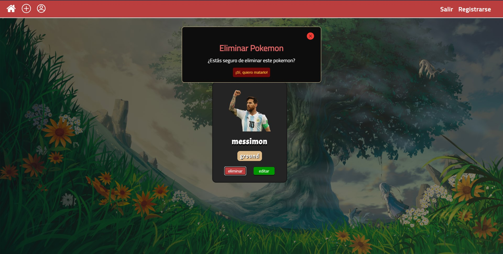
</p>
<br>

[**See Deploy**](https://pokeapi-beryl.vercel.app/)

[**See Repository**](https://github.com/Nitsuga159/PI-Pokemon)

---

## **Campy [campy]**

```
📌 Final group project of Bootcamp Henry.

A place where lovers of Argentine camping can find their next trip.

I worked as one of the backend developer managers at:
-Backend structure
-User system
-Login/Register with JWT/Auth0
-Relations and database table models
-Mails with Nodemailer

I worked as a frontend developer in:
-login logic
-Dashboards
-Update an camping

Tech Utils:
Front-End: ReactJS, Redux, Material-UI, HTML, CSS, JavaScript, Typescript
Back-End: NodeJS, Express, Sequelize
Database: MySQL

Additional Libraries:

✔ JWT/Auth0 (Login/Login with Google)
✔ Mercado Pago (Payment)
✔ Cloudinary (Upload profile picture)
✔ Nodemailer (Sending of mails)
```

<p align="center">
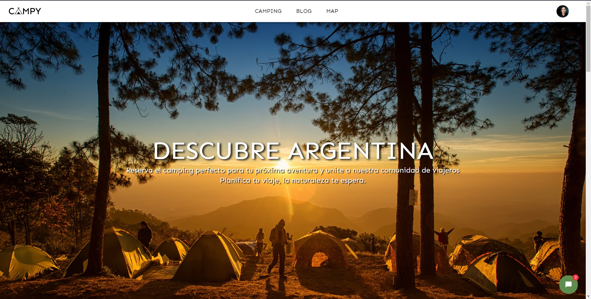
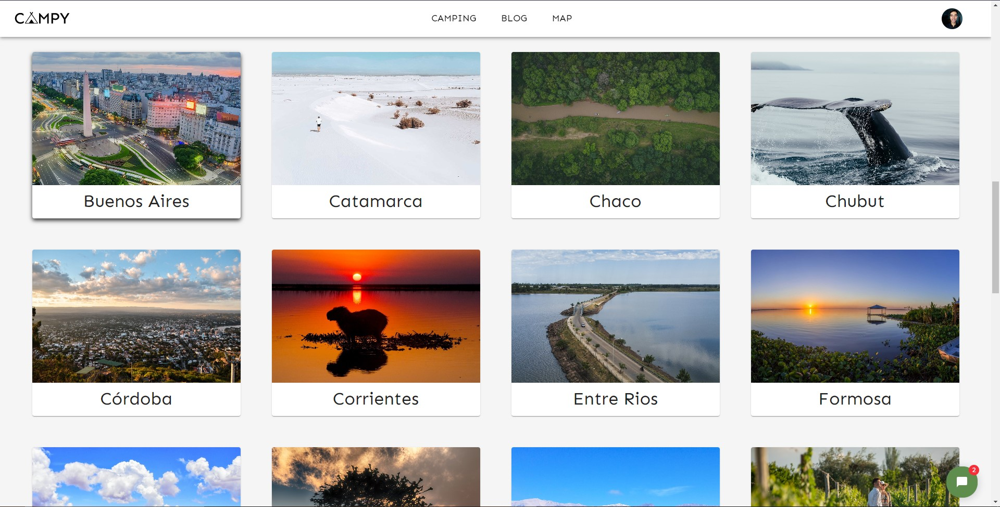
</p>
<p align="center">
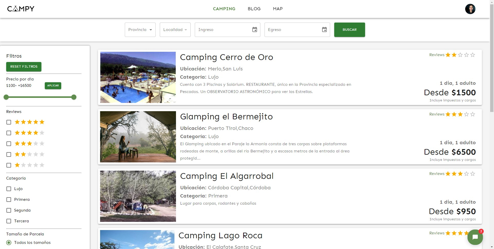
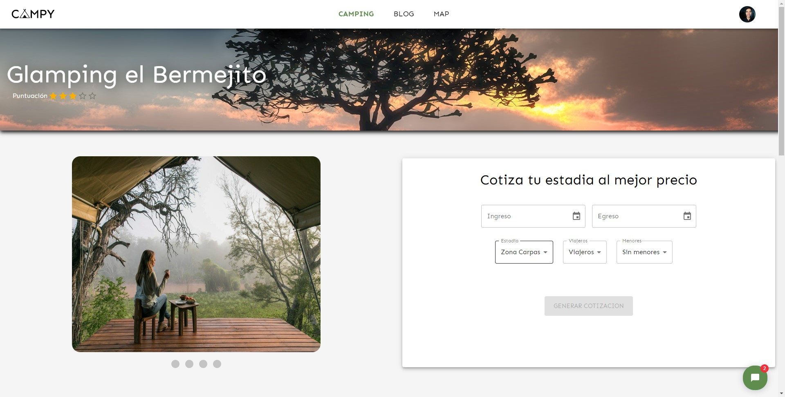
</p>
<p align="center">
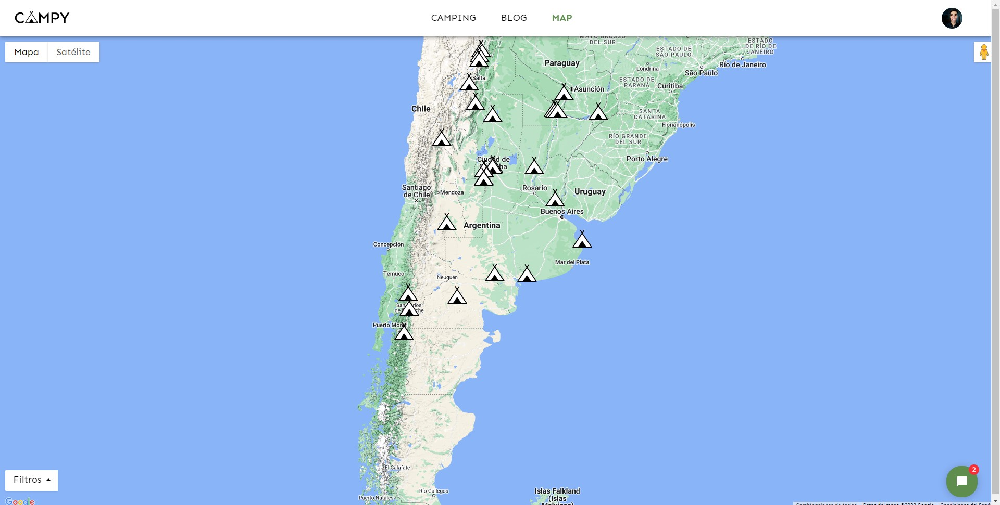
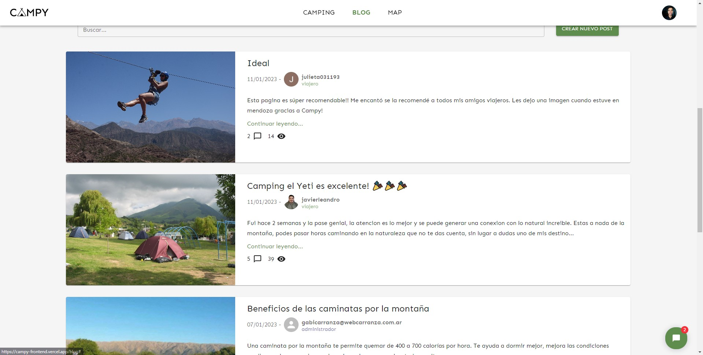
</p>
<p align="center">
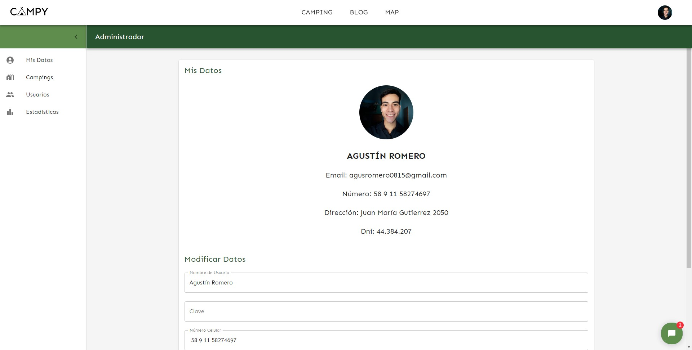
</p>
<br>

[**See Deploy**](https://campy-frontend.vercel.app/)

[**See Repository Backend**](https://github.com/javierleandromontenegro/Campy-backend)

[**See Repository Frontend**](https://github.com/ACRUNO/Campy-frontend)

---

## 📫 CONTACT ME

Do you want to work together?

**Email:** agusromero0815@gmail.com

**Wpp:** +54 9 11 58274697

**Portfolio:** https://portfolio-159.vercel.app/

<p align="left">
<a href="https://www.linkedin.com/in/agust%C3%ADn-romero-33919b24b/" target="blank">

</a>
</p>
